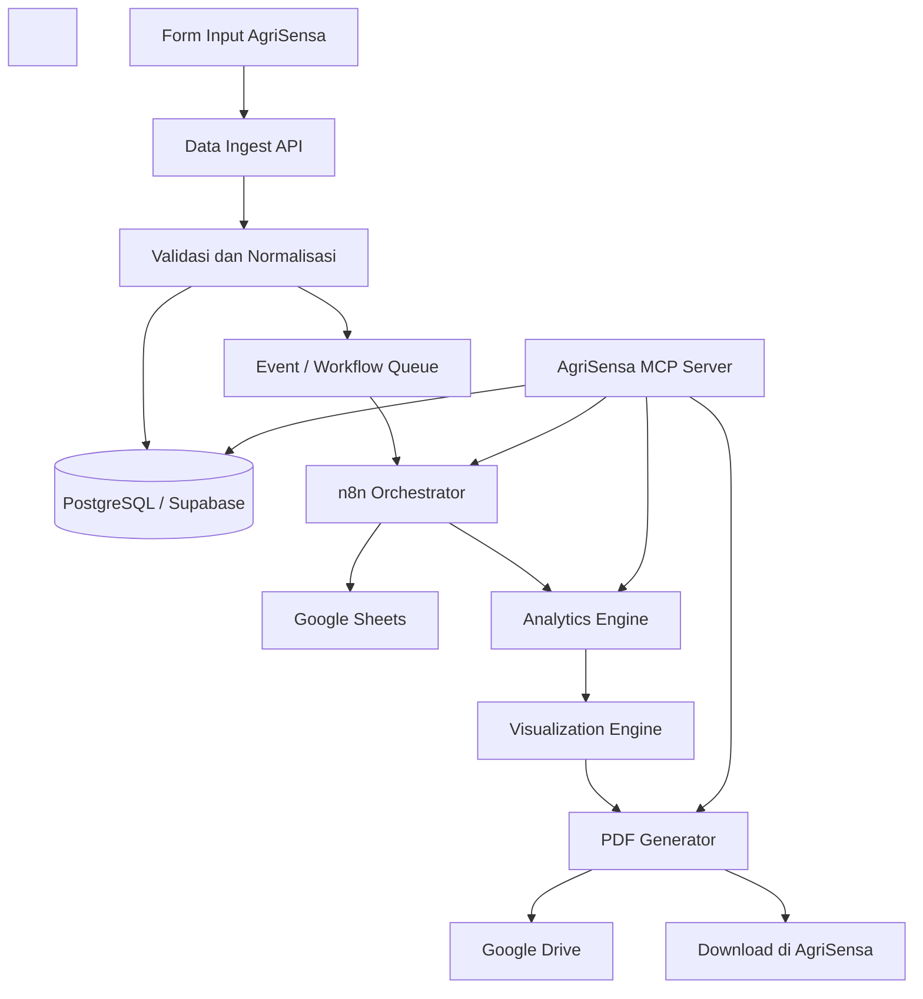

# AgriSensa Harvest Intelligence & Reporting

## Blueprint Arsitektur Data Ingest, Google Workspace, MCP, Visualisasi, dan Laporan PDF

**Nama proyek:** AgriSensa Harvest Intelligence & Reporting  
**Ekosistem:** AgriSensa AI  
**Pemilik proyek:** Andriyanto  
**Status dokumen:** Rancangan arsitektur awal  
**Versi:** 1.0  
**Tanggal:** 17 September 2026

---

## 1\. Ringkasan Eksekutif

AgriSensa Harvest Intelligence & Reporting merupakan modul untuk menerima data hasil panen, membersihkan dan memvalidasi data, menyimpannya dalam database, menyinkronkannya ke Google Workspace, menghasilkan analisis dan visualisasi, serta membuat laporan PDF yang dapat diunduh atau disimpan ke Google Drive.

MCP (*Model Context Protocol*) digunakan sebagai lapisan akses terstandar agar asisten AI atau agen AI dapat mencari data, menjalankan analisis, membuat visualisasi, menghasilkan laporan, dan berinteraksi dengan layanan AgriSensa melalui kumpulan *tools* yang aman dan terdokumentasi.

MCP tidak menggantikan API, database, maupun workflow engine. Komponen-komponen tersebut memiliki fungsi berbeda:

| Komponen | Fungsi utama |
| :---- | :---- |
| Frontend AgriSensa | Form input, dashboard, dan unduhan laporan |
| Data Ingest API | Menerima, memvalidasi, dan menormalisasi data |
| Database | Sumber data utama atau *single source of truth* |
| n8n | Orkestrasi workflow dan integrasi antar-layanan |
| Google Sheets | Kolaborasi, rekap operasional, dan analisis ringan |
| Google Drive | Penyimpanan laporan, gambar, dan dokumen |
| Analytics Engine | Perhitungan KPI, agregasi, prediksi, dan rekomendasi |
| Visualization Engine | Pembuatan grafik, tabel, peta, dan komponen visual |
| PDF Generator | Mengubah hasil analisis menjadi laporan PDF |
| MCP Server | Menyediakan tools agar AI dapat mengakses layanan AgriSensa |

---

## 2\. Tujuan Sistem

Sistem dirancang untuk:

1. Mencatat hasil panen secara terstruktur dan dapat ditelusuri.  
2. Mengurangi kesalahan input melalui validasi otomatis.  
3. Menyediakan rekap data di Google Sheets tanpa menjadikannya database utama.  
4. Menghasilkan indikator produktivitas dan ekonomi usaha tani.  
5. Menampilkan grafik dan visualisasi yang mudah dipahami.  
6. Membuat laporan PDF otomatis dengan identitas AgriSensa.  
7. Menyimpan laporan ke Google Drive dan menyediakan tautan unduhan.  
8. Memungkinkan agen AI mengakses fungsi sistem melalui MCP.  
9. Menjaga keamanan, auditabilitas, dan konsistensi data.  
10. Menjadi fondasi untuk analisis prediktif, rekomendasi budidaya, dan *decision support system*.

---

## 3\. Ruang Lingkup

### 3.1 Ruang lingkup fase awal

- Input data petani, kebun, komoditas, musim tanam, hasil panen, kualitas, harga, dan biaya.  
- Validasi serta normalisasi data.  
- Penyimpanan dalam PostgreSQL/Supabase.  
- Sinkronisasi data terpilih ke Google Sheets.  
- Perhitungan KPI hasil panen dan ekonomi.  
- Visualisasi grafik dan tabel.  
- Pembuatan laporan PDF.  
- Penyimpanan PDF ke Google Drive.  
- Penyediaan MCP tools untuk operasi utama.

### 3.2 Pengembangan lanjutan

- Integrasi data cuaca historis dan prakiraan.  
- Integrasi harga pasar lokal, modern, dan ekspor.  
- Peta spasial dengan PostGIS.  
- Deteksi anomali hasil panen.  
- Prediksi produktivitas, harga, dan pendapatan.  
- Rekomendasi waktu tanam dan panen.  
- Analisis risiko dengan simulasi Monte Carlo.  
- Integrasi Computer Vision untuk klasifikasi mutu atau kerusakan hasil.  
- Analisis lintas petani, wilayah, varietas, dan musim.

---

## 4\. Prinsip Arsitektur

1. **Database sebagai sumber utama:** PostgreSQL/Supabase menjadi sumber data resmi. Google Sheets merupakan salinan kerja dan kolaborasi.  
2. **API-first:** Semua fungsi inti tersedia melalui API sebelum diekspos sebagai MCP tools.  
3. **Idempotensi:** Permintaan yang sama tidak menghasilkan duplikasi data.  
4. **Traceability:** Setiap record memiliki ID, waktu, pengguna, sumber, dan riwayat perubahan.  
5. **Asynchronous processing:** Sinkronisasi, visualisasi berat, dan PDF diproses melalui antrean atau workflow latar belakang.  
6. **Least privilege:** Akses database, Google Workspace, dan MCP dibatasi sesuai peran.  
7. **Human-in-the-loop:** Rekomendasi AI tidak langsung mengubah data penting tanpa persetujuan.  
8. **Reusable services:** Analytics, visualisasi, dan laporan dapat digunakan frontend, n8n, API, maupun MCP.  
9. **Privacy by design:** Data pribadi petani tidak dikirim ke model AI jika tidak diperlukan.  
10. **Observability:** Log, metrik, dan status workflow tersedia untuk diagnosis.

---

## 5\. Arsitektur Tingkat Tinggi



### 5.1 Aliran data utama

1. Pengguna mengisi form hasil panen.  
2. Frontend mengirim data ke Data Ingest API.  
3. API memvalidasi dan menormalisasi data.  
4. Data valid disimpan ke database.  
5. Sistem menerbitkan event `harvest.created` atau `harvest.updated`.  
6. n8n menerima event dan menjalankan sinkronisasi Google Sheets.  
7. Analytics Engine menghitung KPI.  
8. Visualization Engine membuat grafik.  
9. PDF Generator membuat laporan.  
10. Laporan disimpan ke Google Drive dan dapat diunduh melalui AgriSensa.

---

## 6\. Data yang Dikumpulkan

### 6.1 Identitas record

| Field | Tipe | Wajib | Keterangan |
| :---- | :---- | ----: | :---- |
| `harvest_id` | UUID | Ya | ID unik hasil panen |
| `farm_id` | UUID/String | Ya | ID kebun |
| `farmer_id` | UUID/String | Ya | ID petani/pengelola |
| `season_id` | UUID/String | Ya | ID musim tanam |
| `source` | Enum | Ya | Web, mobile, Sheets, API, atau import |
| `created_at` | Timestamp | Ya | Waktu pembuatan |
| `updated_at` | Timestamp | Ya | Waktu perubahan terakhir |
| `created_by` | UUID/String | Ya | Pengguna pembuat data |

### 6.2 Informasi kebun dan lokasi

- Nama kebun atau blok lahan.  
- Desa/kelurahan, kecamatan, kabupaten, provinsi, dan negara.  
- Koordinat lintang dan bujur.  
- Luas lahan dan satuannya.  
- Ketinggian tempat.  
- Jenis tanah jika tersedia.  
- Sistem budidaya: konvensional, organik, hidroponik, rumah kaca, atau lainnya.

### 6.3 Informasi komoditas

- Komoditas.  
- Varietas.  
- Tanggal tanam.  
- Tanggal mulai panen.  
- Tanggal panen saat ini.  
- Panen keberapa.  
- Populasi awal tanaman.  
- Populasi produktif saat panen.

### 6.4 Kuantitas dan mutu hasil

- Total hasil panen.  
- Hasil layak jual.  
- Hasil rusak atau ditolak.  
- Hasil per grade: A, B, C, atau grade khusus.  
- Satuan: kilogram, ton, kuintal, peti, ikat, atau unit.  
- Kadar air jika relevan.  
- Penyebab kerusakan.  
- Foto hasil panen.

### 6.5 Penjualan

- Harga jual per unit.  
- Jumlah terjual.  
- Pendapatan kotor.  
- Pembeli atau kanal penjualan.  
- Jenis pasar: lokal, pasar induk, supermarket, industri, ekspor, atau langsung ke konsumen.  
- Metode pembayaran.  
- Biaya transportasi dan pemasaran.

### 6.6 Biaya produksi

- Benih/bibit.  
- Pupuk.  
- Pestisida dan pengendalian hayati.  
- Tenaga kerja.  
- Irigasi dan energi.  
- Sewa lahan.  
- Alat dan penyusutan.  
- Kemasan.  
- Transportasi.  
- Biaya pascapanen.  
- Biaya lain-lain.

### 6.7 Kondisi produksi

- Curah hujan dan suhu.  
- Kelembapan.  
- Kejadian cuaca ekstrem.  
- Hama dan penyakit dominan.  
- Tingkat serangan.  
- Perlakuan budidaya penting.  
- Catatan lapangan.

---

## 7\. Contoh Payload Data Ingest

```json
{
  "farm_id": "FARM-001",
  "farmer_id": "USR-028",
  "season_id": "SEASON-2026-01",
  "commodity": "Cabai Merah",
  "variety": "Lado F1",
  "planting_date": "2026-05-10",
  "harvest_date": "2026-09-17",
  "harvest_sequence": 3,
  "land_area": 0.5,
  "land_area_unit": "ha",
  "harvest_quantity": 3250,
  "quantity_unit": "kg",
  "marketable_quantity": 2980,
  "damaged_quantity": 270,
  "selling_price_per_unit": 42000,
  "currency": "IDR",
  "production_cost": 68500000,
  "sales_channel": "pasar_induk",
  "location": {
    "village": "Sumbang",
    "district": "Sumbang",
    "regency": "Banyumas",
    "province": "Jawa Tengah",
    "latitude": -7.343,
    "longitude": 109.244
  },
  "quality_grades": [
    {"grade": "A", "quantity_kg": 1800},
    {"grade": "B", "quantity_kg": 850},
    {"grade": "C", "quantity_kg": 330}
  ],
  "pest_disease": [
    {
      "name": "Antraknosa",
      "severity_percent": 8,
      "treatment": "Sanitasi dan fungisida sesuai SOP"
    }
  ],
  "notes": "Panen ketiga dengan mutu dominan grade A"
}
```

---

## 8\. Data Ingest API

### 8.1 Endpoint utama

| Method | Endpoint | Fungsi |
| :---- | :---- | :---- |
| `POST` | `/api/v1/harvests` | Membuat record panen |
| `GET` | `/api/v1/harvests/{harvest_id}` | Mengambil detail panen |
| `PATCH` | `/api/v1/harvests/{harvest_id}` | Memperbarui sebagian data |
| `DELETE` | `/api/v1/harvests/{harvest_id}` | Soft delete record |
| `GET` | `/api/v1/harvests` | Mencari dan memfilter data |
| `POST` | `/api/v1/harvests/import` | Impor CSV/XLSX |
| `POST` | `/api/v1/harvests/{id}/sync` | Menjalankan ulang sinkronisasi |
| `POST` | `/api/v1/harvests/{id}/report` | Membuat laporan |
| `GET` | `/api/v1/reports/{report_id}` | Status dan metadata laporan |
| `GET` | `/api/v1/reports/{report_id}/download` | Mengunduh PDF |

### 8.2 Validasi inti

- Tanggal panen tidak boleh lebih awal dari tanggal tanam.  
- Luas lahan dan hasil panen harus lebih besar dari nol.  
- Hasil layak jual ditambah hasil rusak tidak boleh melebihi total panen, kecuali ada kategori lain yang dicatat.  
- Harga dan biaya tidak boleh negatif.  
- Satuan harus berasal dari daftar yang disetujui.  
- Mata uang menggunakan kode ISO, misalnya `IDR` atau `JPY`.  
- Koordinat harus berada pada rentang valid.  
- `farm_id`, `farmer_id`, dan `season_id` harus memiliki relasi yang sah.  
- Request harus memiliki `idempotency_key` untuk mencegah duplikasi.

### 8.3 Normalisasi

- Kuantitas dikonversi ke kilogram sebagai satuan analitik utama.  
- Luas dikonversi ke hektare.  
- Waktu disimpan sebagai UTC dan ditampilkan menurut zona pengguna.  
- Nama komoditas dan varietas menggunakan master data.  
- Nilai uang menyimpan mata uang asal dan, bila dibutuhkan, nilai konversi.

---

## 9\. Desain Database Awal

### 9.1 Tabel inti

| Tabel | Fungsi |
| :---- | :---- |
| `users` | Pengguna dan otorisasi |
| `farmers` | Profil petani/pengelola |
| `farms` | Identitas kebun dan lokasi |
| `plots` | Blok atau petak lahan |
| `commodities` | Master komoditas |
| `varieties` | Master varietas |
| `seasons` | Musim atau siklus tanam |
| `harvests` | Data utama hasil panen |
| `harvest_grades` | Rincian mutu/grade |
| `production_costs` | Rincian biaya |
| `sales` | Transaksi atau ringkasan penjualan |
| `pest_disease_events` | Kejadian hama dan penyakit |
| `weather_observations` | Data cuaca terkait |
| `sync_jobs` | Status sinkronisasi eksternal |
| `reports` | Metadata dan lokasi laporan |
| `audit_logs` | Riwayat perubahan dan aktivitas |

### 9.2 Status record

Gunakan status berikut:

- `draft`: belum lengkap.  
- `submitted`: dikirim oleh pengguna.  
- `validated`: lolos pemeriksaan.  
- `needs_review`: membutuhkan pemeriksaan manusia.  
- `approved`: disahkan.  
- `synced`: berhasil disinkronkan.  
- `archived`: tidak aktif tetapi tetap tersimpan.

---

## 10\. Integrasi Google Workspace

### 10.1 Peran Google Sheets

Google Sheets digunakan untuk:

- Rekap operasional.  
- Kolaborasi dengan tim.  
- Pemeriksaan manual.  
- Analisis ringan dan pivot table.  
- Sumber dashboard sederhana.  
- Ekspor atau pertukaran data.

Google Sheets tidak disarankan sebagai satu-satunya database karena rawan perubahan manual, duplikasi, keterbatasan kontrol relasi, dan konflik saat volume data meningkat.

### 10.2 Struktur spreadsheet

| Sheet | Isi |
| :---- | :---- |
| `Harvest_Raw` | Salinan data asli yang masuk |
| `Harvest_Clean` | Data terstandar dan tervalidasi |
| `Farm_Master` | Data kebun, petani, dan lokasi |
| `Commodity_Master` | Komoditas, varietas, dan satuan |
| `Cost_Detail` | Rincian biaya produksi |
| `Sales_Detail` | Rincian hasil penjualan |
| `Pest_Disease` | Hama, penyakit, dan tingkat serangan |
| `KPI_Summary` | KPI per kebun, musim, dan komoditas |
| `Report_Log` | Riwayat laporan PDF |
| `Sync_Log` | Status sinkronisasi dan pesan kesalahan |

### 10.3 Kolom minimum `Harvest_Clean`

```text
harvest_id
farm_id
farmer_id
season_id
commodity
variety
harvest_date
harvest_sequence
land_area_ha
harvest_kg
marketable_kg
damaged_kg
selling_price_idr_per_kg
revenue_idr
production_cost_idr
profit_idr
productivity_kg_per_ha
loss_rate_percent
sales_channel
district
regency
province
validation_status
sync_timestamp
```

### 10.4 Aturan sinkronisasi

- Database ke Google Sheets adalah arah utama.  
- Setiap baris memakai `harvest_id` sebagai kunci.  
- Perubahan tidak menambah baris baru jika ID sudah ada.  
- Kolom formula atau catatan manual dipisahkan dari kolom yang dikelola sistem.  
- Sistem menyimpan `sheet_id`, `sheet_name`, `row_number`, `sync_status`, dan `last_synced_at`.  
- Sinkronisasi gagal harus memiliki mekanisme retry dan *dead-letter queue*.  
- Perubahan manual dari Sheets ke database hanya diperbolehkan melalui workflow khusus dan validasi ulang.

### 10.5 Struktur folder Google Drive

```text
AgriSensa/
├── Harvest Intelligence/
│   ├── 2026/
│   │   ├── Cabai Merah/
│   │   │   ├── Banyumas/
│   │   │   ├── Reports/
│   │   │   └── Charts/
│   ├── Templates/
│   └── Archives/
├── Raw Imports/
└── Audit Exports/
```

---

## 11\. Workflow n8n

### 11.1 Workflow pencatatan panen

1. **Webhook Trigger:** menerima event `harvest.created`.  
2. **Verify Signature:** memverifikasi tanda tangan webhook.  
3. **Get Harvest Data:** mengambil record resmi dari API.  
4. **Validation Check:** memastikan status `validated` atau `approved`.  
5. **Google Sheets Lookup:** mencari `harvest_id`.  
6. **Upsert Row:** menambah atau memperbarui baris.  
7. **Calculate KPI:** memanggil Analytics API.  
8. **Update KPI Sheet:** memperbarui ringkasan KPI.  
9. **Create Report Job:** membuat pekerjaan laporan bila diperlukan.  
10. **Update Sync Status:** menyimpan hasil sinkronisasi.

### 11.2 Workflow laporan PDF

1. Trigger manual, terjadwal, atau dari MCP.  
2. Ambil data dan KPI dari API.  
3. Ambil template laporan.  
4. Buat grafik dan peta.  
5. Render HTML.  
6. Konversi HTML menjadi PDF.  
7. Unggah PDF ke Google Drive.  
8. Simpan metadata laporan ke database.  
9. Perbarui `Report_Log` di Google Sheets.  
10. Kirim tautan download ke frontend atau pengguna.

### 11.3 Penanganan kesalahan

- Retry otomatis dengan *exponential backoff*.  
- Maksimum percobaan ditentukan per node.  
- Error permanen masuk ke antrean pemeriksaan.  
- Notifikasi hanya dikirim untuk kegagalan yang memerlukan tindakan.  
- Setiap workflow menyimpan `workflow_run_id` dan `correlation_id`.

---

## 12\. KPI dan Rumus Analitik

### 12.1 KPI produksi

```text
Produktivitas (kg/ha) = Total Panen (kg) / Luas Lahan (ha)

&nbsp;

Marketable Yield (%) = Hasil Layak Jual / Total Panen × 100

&nbsp;

Loss Rate (%) = Hasil Rusak / Total Panen × 100

&nbsp;

Survival Rate (%) = Populasi Produktif / Populasi Awal × 100
```

### 12.2 KPI ekonomi

```text
Pendapatan Kotor = Jumlah Terjual × Harga Jual per Unit

&nbsp;

Keuntungan Bersih = Pendapatan Kotor − Total Biaya

&nbsp;

Biaya per kg = Total Biaya / Total Panen

&nbsp;

Margin Keuntungan (%) = Keuntungan Bersih / Pendapatan Kotor × 100

&nbsp;

ROI (%) = Keuntungan Bersih / Total Biaya × 100

&nbsp;

Break-even Price = Total Biaya / Hasil Layak Jual

&nbsp;

Revenue per Hectare = Pendapatan Kotor / Luas Lahan

&nbsp;

Profit per Hectare = Keuntungan Bersih / Luas Lahan
```

### 12.3 KPI lanjutan

- Deviasi produktivitas terhadap musim sebelumnya.  
- Deviasi harga terhadap rata-rata pasar.  
- Kontribusi setiap kategori biaya.  
- Indeks risiko hasil panen.  
- Korelasi cuaca dengan produktivitas.  
- Dampak hama dan penyakit terhadap kehilangan hasil.  
- Perbandingan varietas dan lokasi.  
- Estimasi VaR/CVaR pendapatan melalui Monte Carlo.

---

## 13\. Visualisasi

### 13.1 Visual utama

- Kartu KPI: produktivitas, hasil layak jual, pendapatan, laba, dan ROI.  
- Grafik tren hasil panen per tanggal atau panen ke-n.  
- Grafik pendapatan, biaya, dan keuntungan.  
- Grafik komposisi biaya produksi.  
- Grafik distribusi mutu/grade.  
- Grafik persentase kehilangan hasil.  
- Perbandingan musim, varietas, dan lokasi.  
- Peta kebun dan produktivitas wilayah.  
- Heatmap kejadian hama dan penyakit.  
- Grafik hubungan cuaca dan produktivitas.

### 13.2 Pilihan teknologi

| Kebutuhan | Pilihan |
| :---- | :---- |
| Dashboard Next.js | Recharts, ECharts, atau Plotly.js |
| Analisis Python | Pandas, Polars, NumPy |
| Grafik server-side | Plotly \+ Kaleido atau Matplotlib |
| Peta | Mapbox, Leaflet, Folium, atau PostGIS |
| Dashboard Google | Looker Studio |
| Business intelligence internal | Metabase atau Apache Superset |

### 13.3 Output visualisasi

Visualization Engine sebaiknya mendukung:

- JSON untuk frontend interaktif.  
- PNG/SVG untuk laporan PDF.  
- Tabel agregat dalam CSV/XLSX.  
- Metadata grafik: judul, satuan, sumber, periode, filter, dan waktu pembuatan.

---

## 14\. Laporan PDF

### 14.1 Struktur laporan

1. Halaman sampul.  
2. Identitas petani, kebun, komoditas, dan periode.  
3. Ringkasan eksekutif.  
4. KPI produksi.  
5. KPI ekonomi.  
6. Grafik hasil panen dan mutu.  
7. Analisis biaya dan pendapatan.  
8. Analisis kehilangan hasil.  
9. Analisis cuaca, hama, dan penyakit jika tersedia.  
10. Perbandingan terhadap musim atau target.  
11. Temuan utama.  
12. Rekomendasi AgriSensa AI.  
13. Catatan metodologi dan sumber data.  
14. Disclaimer.  
15. Metadata laporan dan QR code verifikasi.

### 14.2 Teknologi PDF

Pilihan utama:

- Template HTML/CSS.  
- Render menggunakan Playwright atau Puppeteer.  
- Grafik dibuat sebagai SVG/PNG.  
- PDF disimpan di object storage dan Google Drive.

Alternatif Python:

- WeasyPrint untuk HTML ke PDF.  
- ReportLab untuk kontrol programatik.

### 14.3 Penamaan file

```text
AgriSensa_Harvest_Report_{commodity}_{farm_id}_{period}_{report_id}.pdf
```

Contoh:

```text
AgriSensa_Harvest_Report_CabaiMerah_FARM-001_2026-09_RPT-0098.pdf
```

### 14.4 Status laporan

- `queued`  
- `processing`  
- `completed`  
- `failed`  
- `expired`

---

## 15\. Desain AgriSensa MCP Server

### 15.1 Peran MCP

MCP berfungsi sebagai lapisan terstandar agar AI dapat:

- Membaca data yang diizinkan.  
- Mencari hasil panen menggunakan filter.  
- Menjalankan analisis dan KPI.  
- Membuat visualisasi.  
- Menjalankan sinkronisasi Google Workspace.  
- Membuat serta mengambil laporan.  
- Menjelaskan hasil analisis dalam bahasa alami.

MCP tidak boleh memberikan akses database mentah tanpa pembatasan. Setiap tool sebaiknya memanggil service/API internal yang sudah memiliki validasi dan otorisasi.

### 15.2 MCP tools yang disarankan

| Tool | Mode | Fungsi |
| :---- | :---- | :---- |
| `create_harvest_record` | Write | Membuat data panen |
| `get_harvest_record` | Read | Mengambil satu record |
| `search_harvests` | Read | Mencari berdasarkan filter |
| `update_harvest_record` | Write | Memperbarui data |
| `validate_harvest_record` | Read/Write | Menjalankan validasi |
| `calculate_harvest_kpis` | Read | Menghitung KPI |
| `compare_harvest_periods` | Read | Membandingkan periode |
| `generate_harvest_charts` | Write | Membuat aset grafik |
| `sync_harvest_to_sheets` | Write | Sinkronisasi Google Sheets |
| `get_sync_status` | Read | Memeriksa status sinkronisasi |
| `create_harvest_report` | Write | Membuat laporan PDF |
| `get_report_status` | Read | Memeriksa status laporan |
| `get_report_download_link` | Read | Menghasilkan tautan aman |
| `save_report_to_drive` | Write | Menyimpan ke Google Drive |
| `get_harvest_insights` | Read | Mendapatkan insight dan anomali |

### 15.3 Contoh input MCP tool

```json
{
  "name": "search_harvests",
  "arguments": {
    "commodity": "Cabai Merah",
    "regency": "Banyumas",
    "start_date": "2026-09-01",
    "end_date": "2026-09-30",
    "status": "approved",
    "limit": 100
  }
}
```

### 15.4 Contoh tool pembuatan laporan

```json
{
  "name": "create_harvest_report",
  "arguments": {
    "scope": "farm",
    "farm_id": "FARM-001",
    "period": "2026-09",
    "include_comparison": true,
    "include_recommendations": true,
    "language": "id",
    "output_format": "pdf",
    "save_to_google_drive": true
  }
}
```

### 15.5 Contoh perintah bahasa alami

> Analisis hasil panen cabai Kebun Sumbang selama September 2026, bandingkan dengan musim sebelumnya, buat grafik produktivitas dan keuntungan, lalu simpan laporan PDF ke Google Drive.

Alur MCP:

1. `search_harvests`  
2. `calculate_harvest_kpis`  
3. `compare_harvest_periods`  
4. `generate_harvest_charts`  
5. `create_harvest_report`  
6. `save_report_to_drive`  
7. `get_report_download_link`

---

## 16\. Interaksi AI, MCP, dan Google Workspace

```mermaid
sequenceDiagram
&nbsp;&nbsp;&nbsp;&nbsp;participant U as Pengguna
&nbsp;&nbsp;&nbsp;&nbsp;participant AI as AgriSensa AI
&nbsp;&nbsp;&nbsp;&nbsp;participant M as MCP Server
&nbsp;&nbsp;&nbsp;&nbsp;participant API as Internal API
&nbsp;&nbsp;&nbsp;&nbsp;participant DB as Database
&nbsp;&nbsp;&nbsp;&nbsp;participant G as Google Workspace

&nbsp;

&nbsp;&nbsp;&nbsp;&nbsp;U->>AI: Analisis panen dan buat PDF
&nbsp;&nbsp;&nbsp;&nbsp;AI->>M: search_harvests
&nbsp;&nbsp;&nbsp;&nbsp;M->>API: Authorized request
&nbsp;&nbsp;&nbsp;&nbsp;API->>DB: Query data
&nbsp;&nbsp;&nbsp;&nbsp;DB-->>API: Data tervalidasi
&nbsp;&nbsp;&nbsp;&nbsp;API-->>M: Dataset dan metadata
&nbsp;&nbsp;&nbsp;&nbsp;AI->>M: calculate_harvest_kpis
&nbsp;&nbsp;&nbsp;&nbsp;AI->>M: create_harvest_report
&nbsp;&nbsp;&nbsp;&nbsp;M->>G: Simpan Sheets dan PDF
&nbsp;&nbsp;&nbsp;&nbsp;G-->>M: File ID dan URL
&nbsp;&nbsp;&nbsp;&nbsp;M-->>AI: Status dan tautan
&nbsp;&nbsp;&nbsp;&nbsp;AI-->>U: Ringkasan dan download PDF
```

---

## 17\. Keamanan dan Privasi

### 17.1 Autentikasi dan otorisasi

- Gunakan OAuth 2.0/OpenID Connect untuk pengguna.  
- MCP menggunakan token terpisah dengan *scopes* terbatas.  
- Google Workspace menggunakan OAuth dengan izin minimum.  
- Terapkan Role-Based Access Control (RBAC).

Contoh peran:

| Peran | Akses |
| :---- | :---- |
| Petani | Data kebun miliknya |
| Field Officer | Data wilayah penugasan |
| Analyst | Data teranonim untuk analisis |
| Manager | Ringkasan dan laporan organisasi |
| Administrator | Konfigurasi, audit, dan akses sistem |

### 17.2 Perlindungan data

- Enkripsi data saat transit dengan TLS.  
- Enkripsi penyimpanan database dan file.  
- Jangan menaruh secret API dalam source code.  
- Gunakan secret manager atau environment variables.  
- Terapkan pembatasan tenant/organisasi pada setiap query.  
- Masking data pribadi saat digunakan untuk analisis agregat.  
- Tautan download PDF menggunakan URL bertanda tangan dan masa berlaku.  
- Log tidak boleh menyimpan token atau data sensitif lengkap.

### 17.3 Keamanan MCP

- Bedakan tool read dan write.  
- Tool write memerlukan konfirmasi untuk operasi penting.  
- Validasi input menggunakan JSON Schema.  
- Batasi jumlah record dan rentang waktu.  
- Cegah prompt injection dari catatan atau dokumen eksternal.  
- MCP tidak mengeksekusi SQL yang dibuat langsung oleh model.  
- Semua panggilan MCP menyimpan `user_id`, `tool_name`, parameter aman, dan hasil status.

---

## 18\. Audit dan Observability

### 18.1 Informasi audit

- Siapa yang membuat atau mengubah data.  
- Kapan perubahan dilakukan.  
- Nilai sebelum dan sesudah perubahan.  
- Sumber perubahan: UI, API, Sheets, workflow, atau MCP.  
- Status validasi dan persetujuan.  
- Riwayat sinkronisasi.  
- Riwayat pembuatan dan unduhan laporan.

### 18.2 Metrik operasional

- Jumlah record masuk per hari.  
- Persentase record valid.  
- Tingkat kegagalan sinkronisasi.  
- Durasi workflow n8n.  
- Durasi pembuatan PDF.  
- Jumlah laporan berhasil/gagal.  
- Error rate API.  
- Latensi MCP tools.  
- Penggunaan penyimpanan.

---

## 19\. Strategi Implementasi

### Fase 1 — Fondasi Data

- Finalisasi skema data.  
- Buat tabel database.  
- Implementasikan form input.  
- Buat Data Ingest API.  
- Terapkan autentikasi dan validasi.  
- Tambahkan audit log.

**Hasil:** data panen dapat masuk dengan aman dan konsisten.

### Fase 2 — Google Workspace

- Siapkan Google Cloud Project dan OAuth.  
- Buat struktur Google Sheets.  
- Buat workflow n8n untuk upsert.  
- Implementasikan status dan retry sinkronisasi.  
- Buat struktur folder Google Drive.

**Hasil:** data tervalidasi tersinkron ke Google Sheets.

### Fase 3 — Analytics dan Visualisasi

- Implementasikan KPI produksi dan ekonomi.  
- Buat endpoint agregasi.  
- Buat dashboard Next.js.  
- Buat grafik server-side untuk laporan.  
- Tambahkan filter waktu, komoditas, kebun, dan wilayah.

**Hasil:** pengguna dapat melihat dashboard dan insight dasar.

### Fase 4 — PDF Reporting

- Buat template HTML/CSS.  
- Integrasikan generator PDF.  
- Tambahkan grafik dan tabel.  
- Simpan PDF ke Drive dan object storage.  
- Tambahkan tautan download aman.

**Hasil:** laporan panen otomatis dapat diunduh dan dibagikan.

### Fase 5 — MCP Server

- Bungkus API internal sebagai MCP tools.  
- Terapkan scopes, RBAC, dan audit.  
- Tambahkan tool pencarian, KPI, visualisasi, sinkronisasi, dan laporan.  
- Uji prompt bahasa alami dan alur multi-tool.

**Hasil:** AgriSensa AI dapat mengoperasikan workflow melalui MCP.

### Fase 6 — Intelligence Lanjutan

- Prediksi produktivitas dan harga.  
- Deteksi anomali.  
- Monte Carlo untuk risiko ekonomi.  
- Computer Vision untuk mutu hasil.  
- Analisis spasial dan rekomendasi berbasis lokasi.

---

## 20\. Stack Teknologi yang Direkomendasikan

| Lapisan | Teknologi |
| :---- | :---- |
| Frontend | Next.js, TypeScript, Tailwind CSS |
| Form dan validasi UI | React Hook Form, Zod |
| Backend API | FastAPI, Python, Pydantic |
| Database | PostgreSQL/Supabase |
| Spatial | PostGIS |
| Queue/cache | Redis \+ Celery/RQ atau managed queue |
| Workflow | n8n |
| Google Workspace | Sheets API, Drive API, Docs API bila diperlukan |
| Analytics | Pandas/Polars, NumPy, scikit-learn |
| Visualisasi web | Recharts, Plotly.js, atau ECharts |
| Visualisasi laporan | Plotly \+ Kaleido atau Matplotlib |
| PDF | Playwright/Puppeteer atau WeasyPrint |
| MCP | MCP Server TypeScript atau Python |
| Object storage | Supabase Storage, S3-compatible, atau Vercel Blob |
| Monitoring | Sentry, OpenTelemetry, Prometheus/Grafana |
| Deployment | Vercel untuk frontend; container/cloud untuk API dan worker |

---

## 21\. Struktur Repository yang Disarankan

```text
agrisensa-harvest-intelligence/
├── apps/
│   ├── web/
│   ├── api/
│   ├── worker/
│   └── mcp-server/
├── packages/
│   ├── schemas/
│   ├── analytics/
│   ├── visualization/
│   ├── reporting/
│   └── google-workspace/
├── workflows/
│   └── n8n/
├── templates/
│   ├── reports/
│   └── charts/
├── database/
│   ├── migrations/
│   ├── seeds/
│   └── policies/
├── tests/
│   ├── unit/
│   ├── integration/
│   └── e2e/
├── docs/
└── infra/
```

---

## 22\. Pengujian

### 22.1 Unit test

- Validasi tanggal, luas, hasil, harga, dan biaya.  
- Konversi satuan.  
- Perhitungan KPI.  
- Transformasi data ke Google Sheets.  
- Pembuatan nama file dan metadata laporan.

### 22.2 Integration test

- API ke database.  
- API ke n8n.  
- n8n ke Google Sheets.  
- PDF Generator ke Google Drive.  
- MCP Server ke internal API.

### 22.3 End-to-end test

Skenario utama:

1. Pengguna login.  
2. Pengguna mengisi data panen.  
3. Data tervalidasi dan tersimpan.  
4. Baris muncul di Google Sheets.  
5. KPI muncul di dashboard.  
6. Pengguna meminta laporan.  
7. PDF berhasil dibuat.  
8. PDF tersedia untuk diunduh dan tersimpan di Google Drive.  
9. Seluruh proses tercatat dalam audit log.

### 22.4 Kasus gagal yang harus diuji

- Input ganda.  
- Nilai negatif atau format tidak valid.  
- Google token kedaluwarsa.  
- Sheets tidak dapat diakses.  
- Workflow n8n berhenti.  
- Generator grafik gagal.  
- PDF terlalu besar.  
- Drive kehabisan kuota.  
- Pengguna tidak memiliki izin.  
- MCP memanggil tool dengan parameter di luar scope.

---

## 23\. Definition of Done untuk MVP

MVP dianggap selesai apabila:

- Form panen dapat digunakan dari perangkat mobile dan desktop.  
- Semua input wajib tervalidasi.  
- Data tersimpan di database dengan ID unik.  
- Sinkronisasi Google Sheets mendukung upsert dan retry.  
- Minimal lima KPI utama dihitung dengan benar.  
- Dashboard menampilkan KPI dan minimal empat grafik.  
- Laporan PDF dapat dibuat dan diunduh.  
- Laporan dapat disimpan ke Google Drive.  
- Minimal enam MCP tools utama berfungsi.  
- RBAC, audit log, dan pengujian alur utama tersedia.  
- Dokumentasi deployment dan operasi tersedia.

---

## 24\. Risiko dan Mitigasi

| Risiko | Dampak | Mitigasi |
| :---- | :---- | :---- |
| Google Sheets dijadikan database utama | Inkonsistensi dan konflik data | Tetapkan database sebagai sumber resmi |
| Input tidak seragam | Analisis tidak akurat | Master data, validasi, dan normalisasi |
| Duplikasi record | KPI salah | UUID dan idempotency key |
| Token Google kedaluwarsa | Sinkronisasi gagal | Refresh token, monitoring, dan reconnect flow |
| PDF lambat dibuat | Pengalaman buruk | Background job dan status polling |
| Akses MCP terlalu luas | Kebocoran atau perubahan data | Scope, RBAC, confirmation, dan audit |
| Insight AI tidak akurat | Keputusan yang keliru | Tampilkan sumber, rumus, confidence, dan disclaimer |
| Volume data meningkat | Sheets dan API lambat | Pagination, agregasi database, dan data warehouse |

---

## 25\. Rekomendasi Arsitektur Final

Komposisi yang paling sesuai untuk AgriSensa:

- **Next.js** untuk form, dashboard, dan halaman laporan.  
- **FastAPI** untuk ingest, query, analytics API, dan report jobs.  
- **PostgreSQL/Supabase \+ PostGIS** sebagai sumber data utama.  
- **n8n** untuk sinkronisasi Google Workspace dan orkestrasi.  
- **Google Sheets** untuk rekap dan kolaborasi.  
- **Google Drive** untuk penyimpanan laporan.  
- **Plotly/Recharts** untuk visualisasi.  
- **Playwright** untuk pembuatan PDF dari HTML.  
- **AgriSensa MCP Server** sebagai jembatan terstandar bagi AI.

Nama modul yang direkomendasikan:

> **AgriSensa Harvest Intelligence & Reporting**  
> *From Field Data to Actionable Agricultural Intelligence*

---

## 26\. Kesimpulan

Fitur input hasil panen AgriSensa sangat layak dikembangkan menjadi sistem data terintegrasi dan diekspos melalui MCP. Arsitektur yang sehat bukan menjadikan MCP sebagai pengganti seluruh komponen, melainkan sebagai lapisan interaksi AI di atas API, database, analytics engine, workflow n8n, dan Google Workspace.

Dengan desain ini, satu input hasil panen dapat berubah menjadi rangkaian proses yang dapat diaudit: data masuk, divalidasi, disimpan, disinkronkan ke Google Sheets, dianalisis, divisualisasikan, dibuat menjadi PDF, disimpan ke Google Drive, lalu digunakan kembali oleh AgriSensa AI untuk menghasilkan insight dan rekomendasi.

Implementasi bertahap dimulai dari kualitas data dan API, kemudian Google Workspace, analytics, PDF, dan terakhir MCP. Urutan ini mengurangi risiko sekaligus memastikan setiap MCP tool dibangun di atas fungsi backend yang stabil dan dapat diuji.

---

## Lampiran A — Checklist Implementasi

### Data dan API

- [ ] Finalisasi skema data.  
- [ ] Buat migration database.  
- [ ] Implementasikan Data Ingest API.  
- [ ] Terapkan idempotency.  
- [ ] Terapkan validasi dan master data.  
- [ ] Tambahkan audit log.

### Google Workspace

- [ ] Konfigurasi Google Cloud Project.  
- [ ] Konfigurasi OAuth consent dan scopes.  
- [ ] Buat spreadsheet utama.  
- [ ] Buat struktur folder Drive.  
- [ ] Implementasikan workflow upsert n8n.  
- [ ] Tambahkan retry dan error logging.

### Analytics dan visualisasi

- [ ] Implementasikan KPI utama.  
- [ ] Buat endpoint agregasi.  
- [ ] Buat dashboard.  
- [ ] Buat grafik statis untuk laporan.  
- [ ] Validasi rumus menggunakan data uji.

### PDF

- [ ] Buat template HTML/CSS.  
- [ ] Integrasikan Playwright/WeasyPrint.  
- [ ] Tambahkan grafik, tabel, metadata, dan disclaimer.  
- [ ] Unggah ke Drive.  
- [ ] Sediakan signed download URL.

### MCP

- [ ] Definisikan JSON Schema setiap tool.  
- [ ] Implementasikan tool read terlebih dahulu.  
- [ ] Tambahkan tool write dengan konfirmasi.  
- [ ] Terapkan scopes dan RBAC.  
- [ ] Tambahkan audit setiap tool call.  
- [ ] Uji rangkaian multi-tool.

### Operasional

- [ ] Monitoring API dan worker.  
- [ ] Dashboard workflow failure.  
- [ ] Backup database.  
- [ ] Rotasi secret.  
- [ ] Dokumentasi pemulihan insiden.  
- [ ] Pengujian end-to-end sebelum produksi.

---

## Lampiran B — Contoh Acceptance Criteria

```gherkin
Feature: Input dan laporan hasil panen

&nbsp;

&nbsp;&nbsp;Scenario: Pengguna memasukkan data panen yang valid
&nbsp;&nbsp;&nbsp;&nbsp;Given pengguna telah login dan memiliki akses ke FARM-001
&nbsp;&nbsp;&nbsp;&nbsp;When pengguna mengirim data hasil panen yang lengkap
&nbsp;&nbsp;&nbsp;&nbsp;Then sistem membuat harvest_id unik
&nbsp;&nbsp;&nbsp;&nbsp;And sistem menyimpan data ke database
&nbsp;&nbsp;&nbsp;&nbsp;And sistem menerbitkan event harvest.created
&nbsp;&nbsp;&nbsp;&nbsp;And data disinkronkan ke Google Sheets

&nbsp;

&nbsp;&nbsp;Scenario: Pengguna meminta laporan PDF
&nbsp;&nbsp;&nbsp;&nbsp;Given data panen telah berstatus approved
&nbsp;&nbsp;&nbsp;&nbsp;When pengguna meminta laporan untuk September 2026
&nbsp;&nbsp;&nbsp;&nbsp;Then sistem menghitung KPI
&nbsp;&nbsp;&nbsp;&nbsp;And sistem membuat grafik
&nbsp;&nbsp;&nbsp;&nbsp;And sistem menghasilkan PDF
&nbsp;&nbsp;&nbsp;&nbsp;And sistem menyimpan PDF ke Google Drive
&nbsp;&nbsp;&nbsp;&nbsp;And pengguna menerima tautan download yang aman
```

---

## Lampiran C — Catatan Pengembangan

Dokumen ini merupakan blueprint arsitektur dan perlu disesuaikan setelah dilakukan audit terhadap repository AgriSensa yang aktif, model autentikasi, skema database yang sudah digunakan, konfigurasi n8n, serta struktur Google Workspace. Nama endpoint, tabel, dan MCP tools dapat dipertahankan sebagai rancangan awal lalu diselaraskan dengan konvensi kode AgriSensa.

&nbsp;